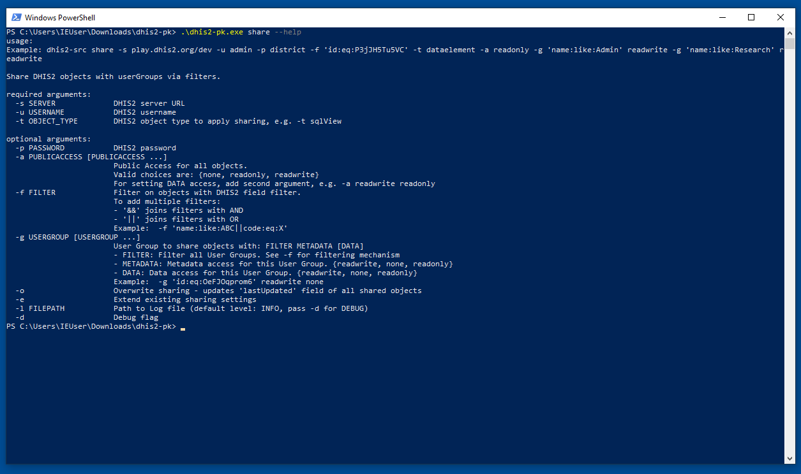

# Installation

## macOS and Linux

Have you already a running Python installation? If not check this guide: https://realpython.com/installing-python
Note: due to End-of-life for Python 2, **Python 3.6+ is required.**

On macOS and Linux, the installation via [pip](https://pip.pypa.io/en/stable/installing) is recommended.

Best way is to install it for your user only:

```bash
pip3 install dhis2-pocket-knife --user --upgrade
```

if it failed, it might be that you are running `pip` - repeat the same with `pip` instead of `pip3`. 
If it is still not working you may not have an installed Python 3 version on your machine.

By providing the `--user` argument you don't clutter your system installation (which might be really bad), but it 
might be that you see a message like `dhis2-pk could not be found`. To fix
this you need to modify your Python PATH - see below. 

### Set up your Python PATH

This guide applies to if you have installed it with the `--user` flag only. 

Open a terminal and paste the following

```bash
echo "export PATH=$(python3 -m site --user-base)/bin:${PATH}" >> ~/.bash_profile && source ~/.bash_profile && dhis2-pk
```

If it shows the dhis2-pk help page all is set. More info on installations to the User Site on [packaging.python.org](https://packaging.python.org/tutorials/installing-packages/#installing-to-the-user-site)

### Updating dhis2-pocket-knife to the latest release

#### Show current version

```bash
pip3 show dhis2-pocket-knife
```
and compare it with the most recent release: 

There is a [changelog](../CHANGELOG.rst) for each (recent) release too.

#### Upgrade

```bash
pip3 install dhis2-pocket-knife --user --upgrade
```

## Windows

On Windows there are two options:

### A) Standard pip installation

Either install it with `pip` as well, but it requires to install Python 3.6+ first. 
[This guide](https://realpython.com/installing-python/#windows) can help. 
Make sure you tick the box for "Add Python3.X to path" during the Python 3 installation process. 

### B) EXE download


Alternatively, download and run an executable file.

* Download dhis2-pk from the
[releases page.](https://github.com/davidhuser/dhis2-pk/releases) under Assets > `dhis2-pk.zip`.
* Extract the zip file
* In Windows, search for the app *PowerShell* or the *Command Prompt* and change (`cd`) to the directory 
where you downloaded and extracted the ZIP file.
* In there you can run dhis2-pk, e.g.: `.\dhis2-pk.exe share --help` (see screenshot below)

Note: `dhis2-pk share ...` will not work as it must related to the .exe downloaded, so the `.\dhis2-pk.exe` is required.



### Further notes on Windows

In the command-line, _do not use single apostrophes_ `'`

 * use the PowerShell app OR 
 * use double apostrophes `"` OR 
 * use no apostrophes at all (no problem when not having whitespaces in filters)
